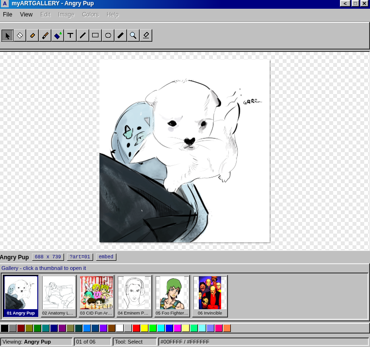
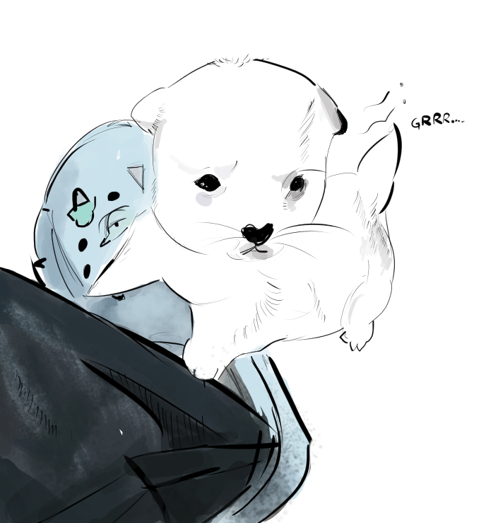
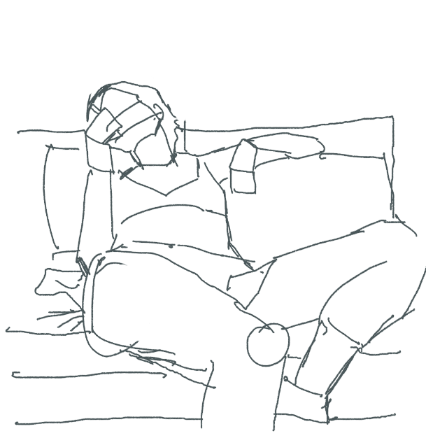
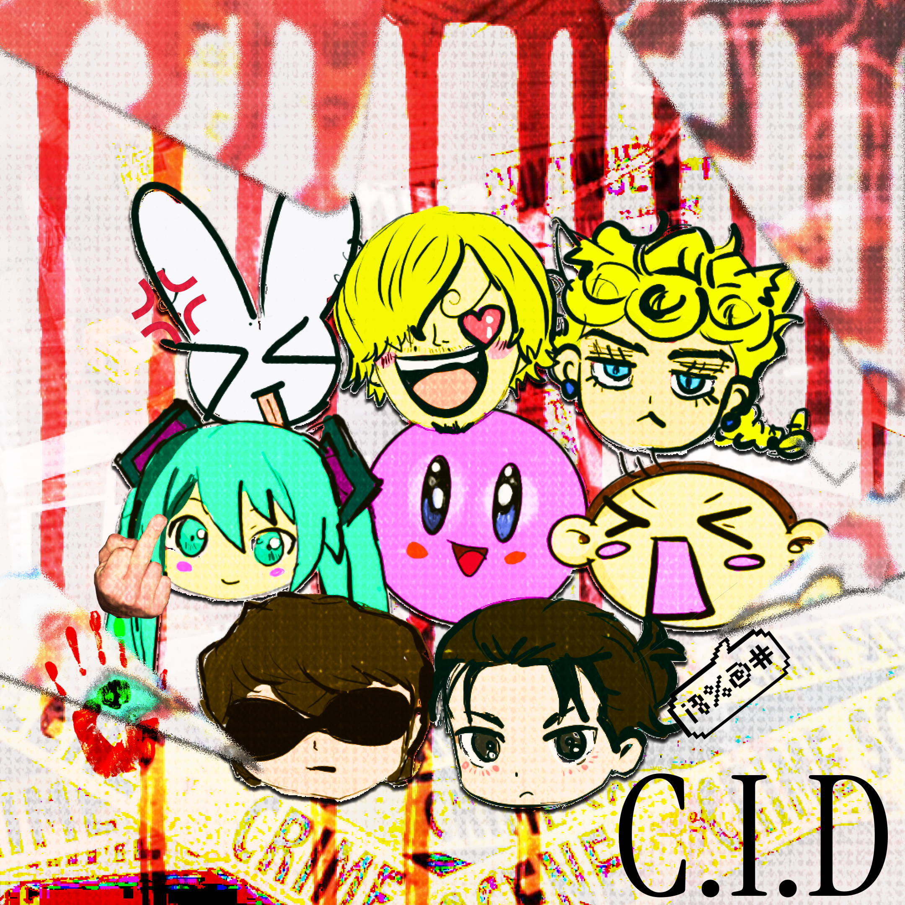
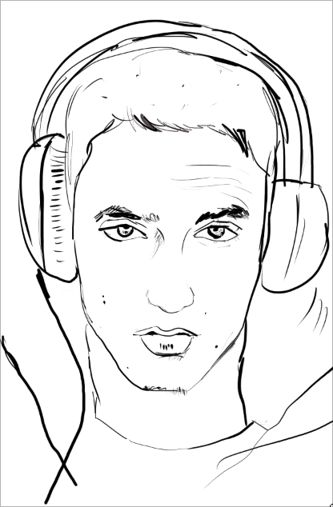
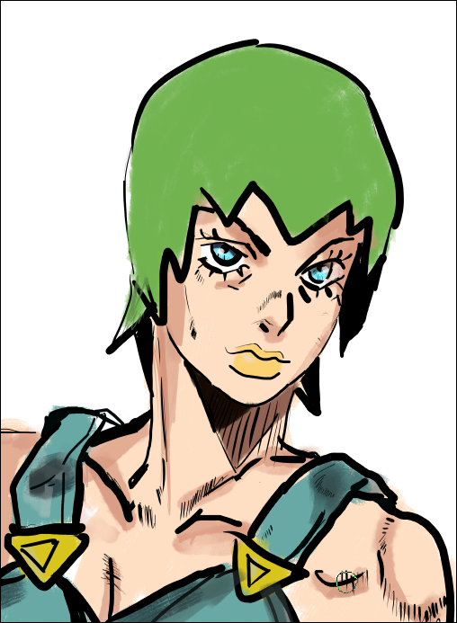
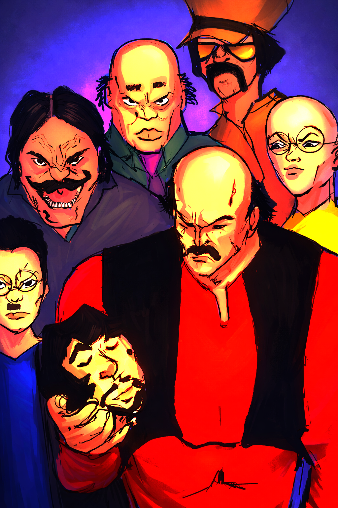

<!-- artworks:start -->
# artgallery

> A retro MS Paint art gallery you can embed straight into your GitHub README



This is an artwork gallery made with mainfocus for artists to be able to embed their artworks directly on readme, since gh is a nice platform to show your art (atleast you can perceive it as one), not restricted to 2D Artworks, be it png, svg, jpg.

## Embed a single artwork

Paste this into any README to drop one piece of art inline:

```html
<iframe src="https://kirbx01.github.io/artgallery/?embed=1&art=01"
        width="512" height="512" frameborder="0" loading="lazy"></iframe>
```
Swap `art=01` for any id from the table above.

## Profile art icons

Use this centered row in a GitHub profile README:

Set `profileIcons.size` in `gallery.config.json` to change the displayed width; each tile stays square.

```html
<p align="center">
  <a href="https://kirbx01.github.io/artgallery/?art=01"></a>
  <a href="https://kirbx01.github.io/artgallery/?art=02"></a>
  <a href="https://kirbx01.github.io/artgallery/?art=03"></a>
  <a href="https://kirbx01.github.io/artgallery/?art=04"></a>
  <a href="https://kirbx01.github.io/artgallery/?art=05"></a>
  <a href="https://kirbx01.github.io/artgallery/?art=06"></a>
</p>
```

## Artworks

| <a href="https://kirbx01.github.io/artgallery/?art=01"><br><sub>01 · Angry Pup</sub></a> | <a href="https://kirbx01.github.io/artgallery/?art=02"><br><sub>02 · Anatomy Lesson (Blockart)</sub></a> | <a href="https://kirbx01.github.io/artgallery/?art=03"><br><sub>03 · CID Fun Art Poster</sub></a> |
| :---: | :---: | :---: |
| <a href="https://kirbx01.github.io/artgallery/?art=04"><br><sub>04 · Eminem Portrait Lineart</sub></a> | <a href="https://kirbx01.github.io/artgallery/?art=05"><br><sub>05 · Foo Fighters JJBA</sub></a> | <a href="https://kirbx01.github.io/artgallery/?art=06"><br><sub>06 · Invincible</sub></a> |
| :---: | :---: | :---: |

## Make this yours

This gallery is meant to be forked. Three steps, no build step:

1. Drop your images into `artworksbyme/` (png, jpg, jpeg, gif, webp, avif, bmp).
2. Edit `gallery.config.json` — your name, tagline, description, grid width, embed size and profile icon size.
3. Run `npm run manifest` and commit.

```bash
cp your-art.png artworksbyme/
npm run manifest
git add artworksbyme/ generated/ js/data.js README.md
git commit -m "Add your-art"
```

Filenames become titles automatically (`my_new_art.png` → "My New Art"). To set one by hand, add it to the `TITLES` map in `tools/build-manifest.mjs`.

Artwork ids are stable: adding or removing a file never renumbers the others, so existing `?art=NN` links and embeds keep working.

Put drafts in `artworksbyme/randoms_drafts/` — subfolders are skipped by the build.

## Credits

Built with vanilla HTML, CSS and JavaScript. Artwork is © kirbx01.
<!-- artworks:end -->

## Local-first CLI (Go)

A tiny Go tool runs the whole gallery on your own machine — no database, no cloud storage, no uploads:

```bash
go build -o artgallery ./cmd/artgallery

./artgallery serve                        # serve the existing web app at http://localhost:8080
./artgallery add your_art.png             # import into artworks/ + square SVG, original kept
./artgallery export --readme --width 64   # centered README snippet → stdout
```

`add` copies your image byte-for-byte into `artworks/`, assigns a stable `NN` id in `artworks/manifest.json` (same conventions as the gallery manifest) and writes a square `artworks/generated/NN.svg` thumbnail. `export --readme` prints a `<p align="center">` snippet where every piece links to its `?art=NN` page — paste it straight into a README, and point `-base` wherever your gallery is served from. Local artwork never leaves your machine.

